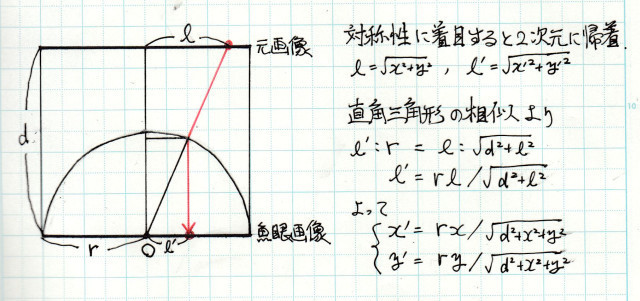

# fisheye_examples
いろいろな言語で魚眼画像への変換

## 概要
いろいろなプログラミング言語で魚眼画像への変換を実装しました。
補間処理は簡単な線形補間です。
画像処理系のライブラリは使わずにアルゴリズムを実装しました。
マウスで画面をさわると、レンズの中心位置を動かすことができます。

## 対応した言語
- [Processing](./fisheye_processing)
- [JavaScript](./fisheye_js)
- [C#](./fisheye_cs)
- [Python](./fisheye_python/) (処理速度に難あり)

## Processing
- Processing 4.3 で動作確認
- この手のことをやるのはProcessingがいちばん簡単。なんの工夫もなく動いた。

## JavaScript
- Webアプリ (Chromeで動作確認)
- [こちら](https://licheng.sakura.ne.jp/hatena15/fisheye_js/) でホスト中 (スマホでも動作)
- ファイルへのアクセスを行っているのでWebサーバでのホストが必要。ローカルのHTMLファイルを開いてもエラーで何も表示されない。VSCodeでLive Serverプラグインを利用するのが簡単。
- 高速化のため、画像全体に対して getImageData / putImageData を使用し、RGBA値が並んだUint8型一次元配列で処理している。

## C#
- Windowsフォームアプリ (Visual Studio 2019で作成/動作確認)
- GetPixel / SetPixel は遅いので、高速化のため LockBits を使用し、画像全体のRGB値が並んだbyte型一次元配列を unsafe でポインタを使って処理している。

## Python
- Python 3.10.0 で動作確認
- Tkinter と Pillow を使用
- getpixel / putpixel は遅いので、高速化のため Image.load を使用し、_PixelAccessor で処理しているが、いまだ十分な処理速度が得られない。作者の環境で1フレームの更新に約1秒もかかる。
- Pythonはfor文が遅い。
